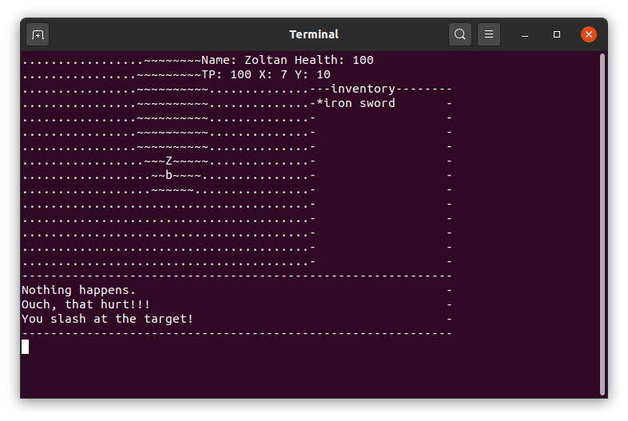
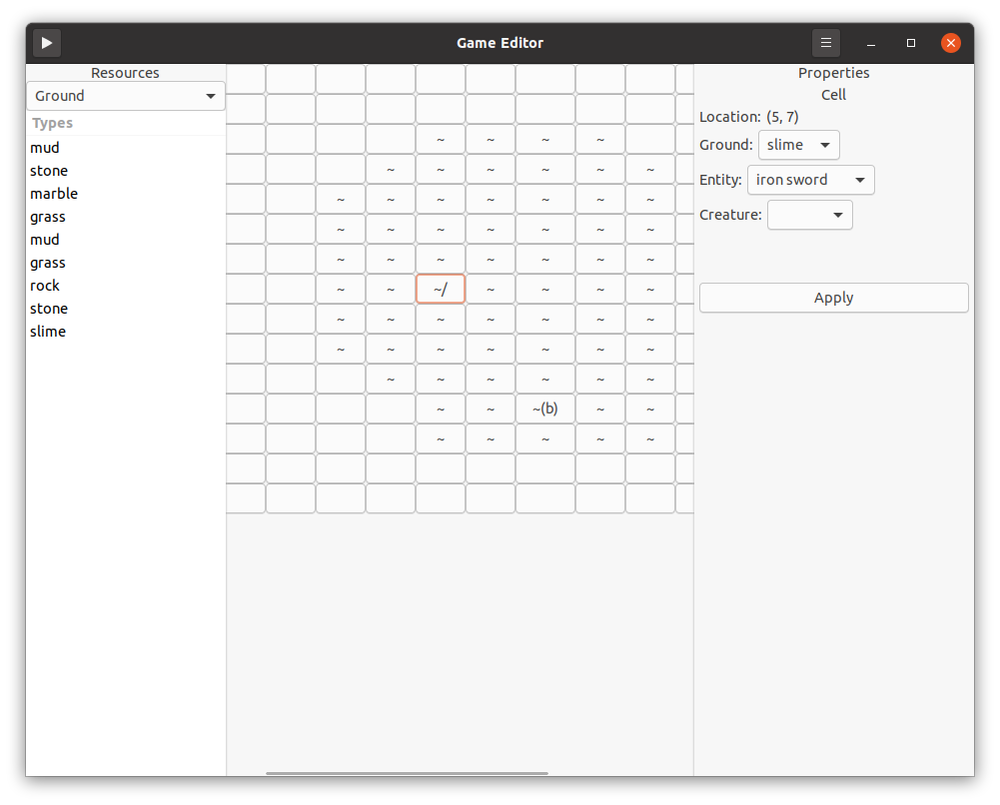

# Text Game
A simple text based game...

## Screenshots

## The Engine Itself
- Basic scripting support. Creatures and things in the game world can be assigned scripts which can make them move or interact with things and the player.
- Basic map and game data loading. The game loads map, item, creature etc. definitions from external files.
- See data/ and data_devel/ for examples of the games data files.
- The idea is for the engine to be powerful enough to create fun gameplay scenarios and little puzzles simply by modifying game data files using the included game editor.

## Game Editor
- There is a simple game editor written in GTK3 found in game_editor, compiling it requires GTK3 development packages installed

## Building
- Currently the game is only tested and running on Ubuntu linux, other distributions should have no trouble compiling it with development tools and GTK3 installed.
- There's some very basic build scripts. `build.sh` just compiles the editor and the main game then copies them together so that the game editor may start the game up with a convenient 'run' button. There's no build system used right now.
- The game itself was originally written to work on windows too, but right now checking and making sure it works isn't a priority.

## Example usage
- ./build_run.sh
- Tap the hamburger button
- Tap 'Load Game'
- Navigate to ./data and select game_1.dat
- Tap the 'play' button to the left of the navigation bar
(Note that this currently assumes you have gnome-terminal installed! See `app.c` - `editor_app_run_game()`)

## Controls
- W, A, S, D - Movement
- p - Pick up item
- t - Talk
- e - Equip item
- u - Use item

## TODO
### Game Editor
- Default terminal selection. Game currently assumes you have gnome-terminal installed. At least until 3D graphics are implemented there has to be a way to change this from some kind of game editor config screen.
- Better item painting. Should be able to `paint` a ground. Right now you need to click a button, then pick the ground type from a dropdown. This won't work with the current button grid implementation, so some kind of custom view needs implementing that supports this click/paint to set content, as well as the current click to see properties. Probably implemented by a mode switch button, to switch between click to paint and click to see cell properties.
- Multiple map support. See the `Game` section. The editor has to support this too!
- Script Editing. There should be a 'scripts' resource type listed with ground/creature/entities. These should be assignable to creatures and entities via the properties window. You should be able to double click a script in the resource list window to replace the map grid with a text editor, for editing the activated script. Perhaps the map grid would be replaced with some kind of tabbed view, and activating the script creates a text editor tab.
- Sound Resource. Similar to scripts, there should be another place for sound resources in the resource panel.
- 3D Models. This has to wait/come with the 3D graphics game addition. There should be a way to assign a 3D model (obj/whatever) to entities, creatures and grounds.

### Game
- Global Actions. Script actions which apply themselves to all matching scripts active in the game world. So a lever might have a global action `unlock xyzpasswordxyz`, this would get broadcasted to all active scripts and if a door had the matching reaction `unlock xyzpasswordxyz` defined in it's script file, the action/reaction pair would run, in this case the door may unlock.
- Cut Scene Support. There should be some way for a script file to activate a cutscene, perhaps defined in a cutscene file, which then triggers a cutscene. A cutscene might just be a full-screen text slideshow to start with. But may evolve into a graphical scene when the game supports 2d/3d graphics.
- Multiple map support. There should be support for multiple game maps. Maps should have 'entrances' tagged with ids. Scripts should be able to trigger a transition from the current map to another map at the specified entrance.
- Saving and loading game state. It should be possible to save the players current progression and reload it later.
- An example game! Once the above items have been complete, a short 1h game should be made with puzzles etc to test the limits of the scripting system and ensure it's powerful enough to create a basic game.
- 3D Graphics. The current textual UI will be replaced with a graphical front-end. The goal will be a first-person dungeon crawler type thing. Think legend of grimrock. This would lend itself to the cell-based map structure I think.
- Menu. A main menu which should have options for 'New Game', 'Load Game' and 'Save Game'.
- Sound. Creatures should have basic sounds assigned to them for basic actions like walking. Scripts should be able to trigger sounds playing. There should be loopable ambient and music tracks, perhaps assigned to maps, and scripts should be able to trigger transitions between them.

