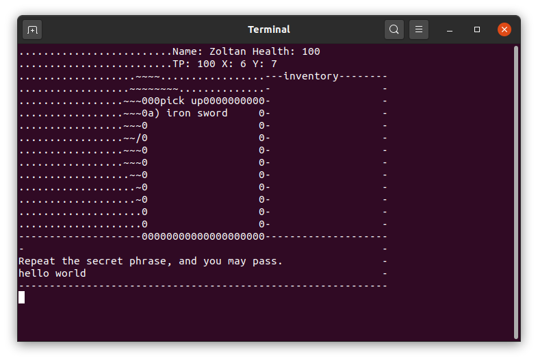

#Text Game
A simple text based game...

##Notes
- See data/ and data_devel/ for examples of the games data files.
- Map data is written as an image file where each r, g, b component represents a different item, creature, ground type specified in the game.dat file. Hopefully at some point a dedicated tool can be created to generate these, rather than a paint tool...
- The engine will include a method of scripting entities to create fun gameplay scenarios and puzzles. This is WIP and examples of it can be found in data_devel/*.script. This is handled in script.c.

##Screenshots

